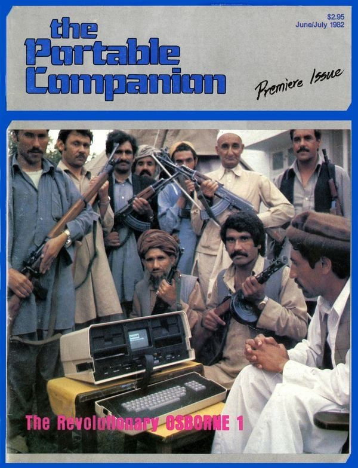
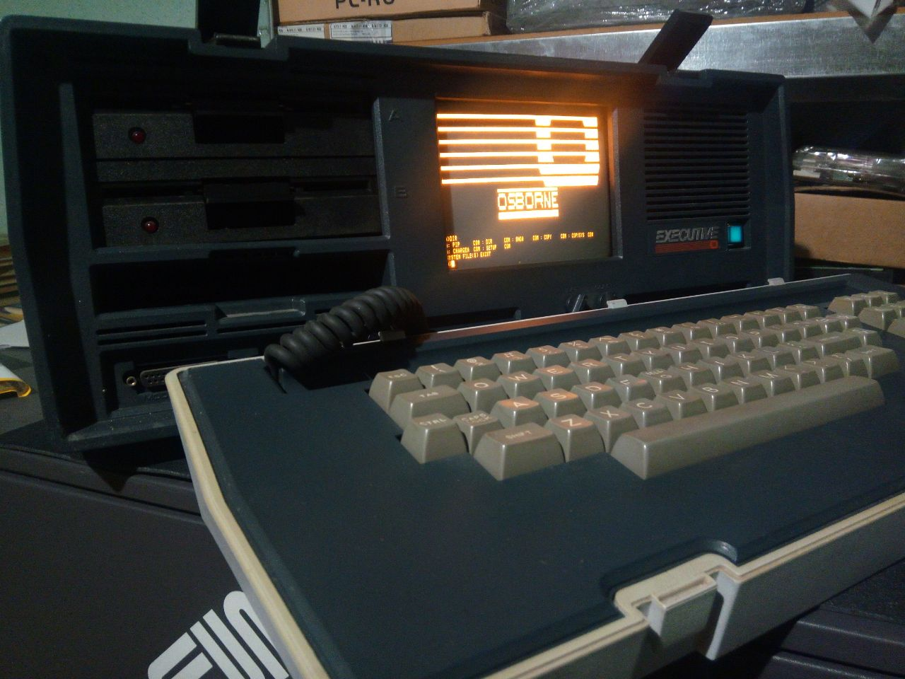
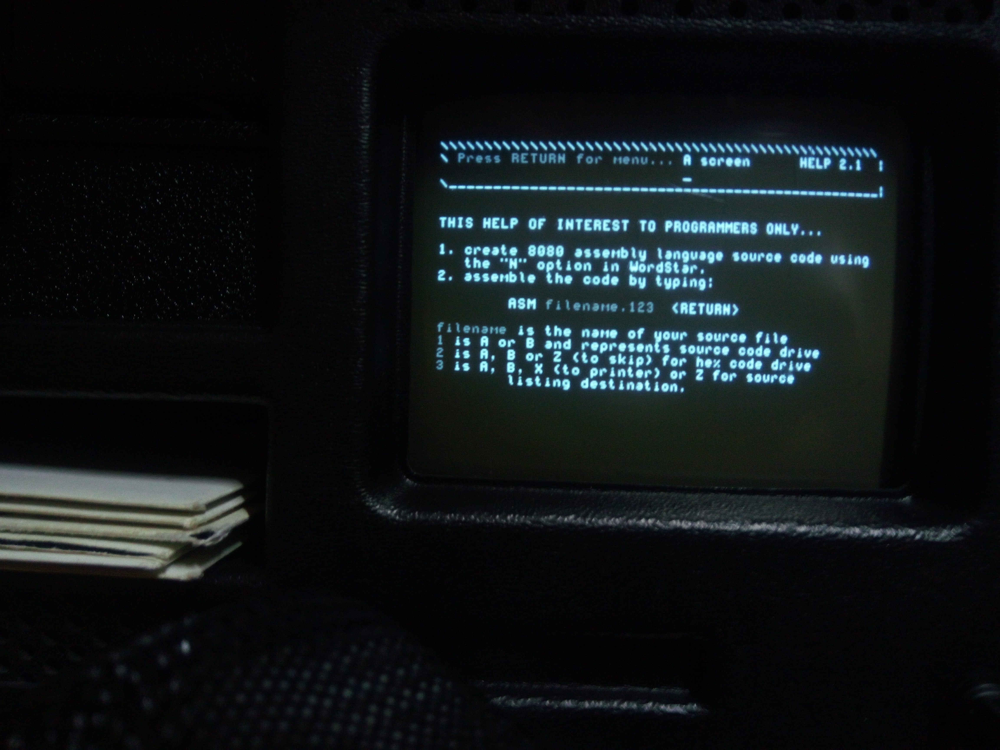
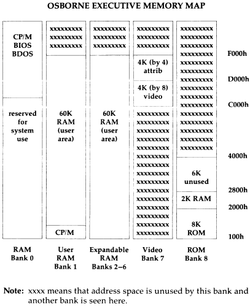
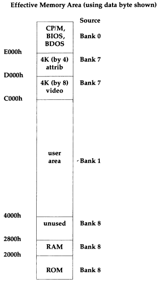
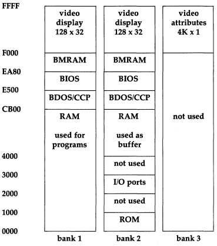

- [Огляд](#огляд)
  - [Osborne Executive](#osborne-executive)
  - [Osborne 1](#osborne-1)
- [Виноски](#виноски)

# Огляд

Osborne Executive -- нащадок [Osborne 1](https://en.wikipedia.org/wiki/Osborne_1), який вважають першим масовим портативним комп'ютером. Як компроміс між переписуванням із відкритих джерел і бажанням мати всю необхідну інформацію під руками, наведу тут лише основні характеристики -- найбільш загальні, або ті, що знадобилися в процесі роботи.  

|  |
|:--------------------------------------------------:|
| Своєрідна реклама із першого видання [''The Portable Companion'']((https://archive.org/details/PortableCompanion19820607)) 1982-го року від компанії-виробника. |

## Osborne Executive

- Випускався в 1982-1983.
- Zilog Z80A, 4 MHz.
- 124 Кб RAM[^2].
- Два дисководи 5.25 дюймів, односторонні, подвійної густини (DD), із 40-ма доріжками. 
  - Незвичним, на наш час, є те, що основним форматом дисків був: розмір сектора 1024 байти -- 1Кб, 5 секторів на доріжку. 
  - Стверджується [вікіпедією](https://en.wikipedia.org/wiki/Osborne_Executive#Compatibility), що може працювати із дисками IBM PC CP/M-86, DEC VT180, Xerox 820, Commodore 128 -- не мав поки нагоди перевірити, але окрім Commodore, формати згадані в [документації, стор. 427](files/3F00186-00_ExecutiveRef_1983.pdf).
  - Розмір -- 200 Кб ''рідного'' формату, 160 Кб -- IBM PC.
  - Під дисководами -- комірка для дисків. 

|  |
|:--------------------------------------------------:|
| Загальний вигляд Osborne Executive, фото моє. |

 - Постачався із CP/M Plus (CP/M 3.0), альернативною ОС -- [UCSD p-System](https://en.wikipedia.org/wiki/UCSD_Pascal)[^3] та великим (на той час) пакетом програмного забезпечення -- WordStar 3.3, SuperCalc 1.12, Personal Pearl 1.02 , MBASIC 5.21/CBASIC 2.38.
 - Термінал близький до [ADM-3A](https://en.wikipedia.org/wiki/ADM-3A) (хоча, документація стверджує, що Escape-коди моделювалися за [TeleVideo 950](http://terminals-wiki.org/wiki/index.php/TeleVideo_950))[^4].
 - Дисплей -- ЕПТ (CRT), монохромний, діагональ -- 7 дюймів.
   - Чисто текстовий, роздільна здатність -- 80 символів на 24 рядки. 
   - Підтримує два набори символів, які можна редагувати.
   - Відеопам'ять -- 4Кб символів, 4Кб -- атрибутів.
 - Клавіатура, на наш час, незвична:
  
 {: width="80%" .align-center}
  
 - Зовнішні під'єднання: IEEE-488/LPT, два  RS-232-С порти (2400/1200/300 бод), композитне відео (RS-470).
 - 52x23x33 см, 13 кг. Батареї не передбачені, але ніби випускалися сторонніми компаніями.
 - 110/220 В, до 55 Вт.
<!--- Desolation -- Занадто нова, але див. https://forum.vcfed.org/index.php?threads/in-search-of-a-legendary-game-for-osborne.1240932/ -->

 ## [Osborne 1](https://en.wikipedia.org/wiki/Osborne_1)

|  |
|:--------------------------------------------------:|
| Мануал до асемблера Osborne 1, із колекції [Віртуального музею комп'ютерного андеграунду](https://www.facebook.com/retro.pc.net), фото моє. |

 Оскільки такого в мене (поки) немає, більш лаконічно:

- Випускався в 1981-1983
- Zilog Z80A, 4 MHz
- 64 Кб RAM[^5].
- Два дисководи 5.25 дюймів, односторонні, одинарної (SD) або подвійної густини (DD), із 40-ма доріжками, 256 байтів на сектор для SD, 1Кб -- для DD[^6]. 
- CP/M 2.2 і [великий пакет програмного забезпечення](https://en.wikipedia.org/wiki/Osborne_1#Software).
- Термінал близький до [ADM-3A](https://en.wikipedia.org/wiki/ADM-3A), дещо менше escape-послідовностей, ніж в Osborne Executive.
 - Дисплей -- ЕПТ (CRT), монохромний, діагональ -- 5 дюймів.
   - Чисто текстовий, роздільна здатність -- 52 символи на 24 рядки. 
 - Зовнішні під'єднання: IEEE-488/LPT, RS-232-С порт (1200/300 бод), композитне відео (RS-470).
 - 52x23x33 см, 11 кг. Батареї не передбачені, але ніби випускалися сторонніми компаніями.
 - 110В, 110/220 В -- нові моделі, до 37 Вт.
 - Існує кілька версій -- 1A, 1B.

# Виноски 

[^1]: Здавалося б, нічого не заважало еспериментувати й раніше -- в емуляторах, але, хоча активно ними користуюся і для хобі і для роботи -- маю велике відторгнення працювати виключно в емуляторах. Ще для справи можу себе змусити, для розваги -- ні.

[^2]: Оскільки адресується лише 64 Кб, одночасно доступно до 60 Кб, плюс підтримка банкінгу. Карта пам'яті із [Osborne Executive Reference Guide](files/3F00186-00_ExecutiveRef_1983.pdf): 
  
  

[^3]: Суб'єктивно, працює помітно швидше, ніж на [Amstrad 1640](https://en.wikipedia.org/wiki/PC1512) -- клоні [XT](https://en.wikipedia.org/wiki/IBM_Personal_Computer_XT), машині суттєво вищого класу.

[^4]: Що має на увазі [вікіпедія](https://en.wikipedia.org/wiki/Osborne_Executive#Compatibility), стверджуючи про сумісність терміналу із [VT100](https://en.wikipedia.org/wiki/Hazeltine_1500) та іншими -- не знаю... Належність до єдиного сімейства [ANSI escape codes](https://en.wikipedia.org/wiki/ANSI_escape_code) реалізацій? Софт, який обіцяє сумісність із VT100 (у відповідному режимі), не працював коректно під час моїх експериментів.

[^5]: Карта пам'яті Osborne 1:
  

[^6]: Детальніше див. сторінку 341 в [Osborne 1 User's Refenece Guide](files/Osborne_1_Users_Reference_Guide_1981.pdf).
  